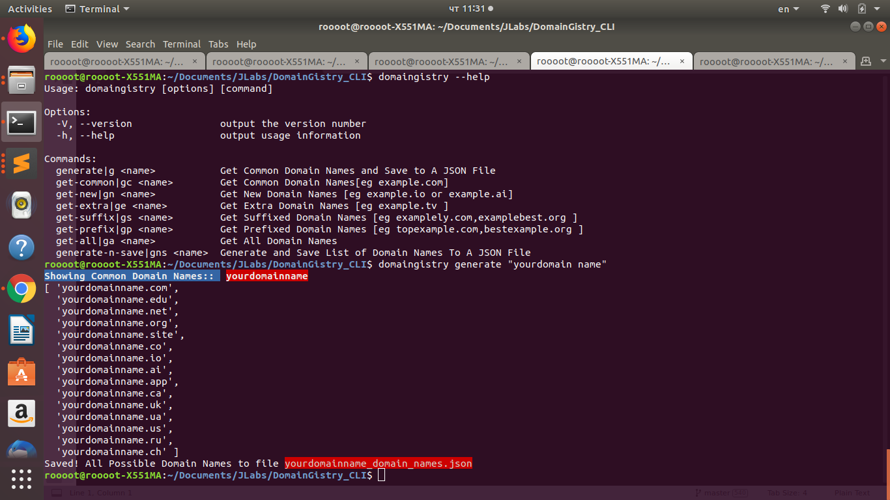

## DomainGistry - A Domain Name Generation CLI
#### Built with Javascript


#### Requirements
+ commander.js
+ chalk.js
+ nodejs

#### Installation


#### Method 1

+ Type the following to install
```js
npm install domaingistry
```


#### Method 2
+ Download repository on github
+ Change into repository
+ Type the following to install
```js
npm install 
```

#### Usage

#### Local Usage
```js
nodejs domaingistry.js --help
```

#### Global Usage
```js
domaingistry --help
```

#### Generating Domain Names
+ Generate the domain name, shows you the common domain name generated, saves to a json file
```js
nodejs domaingistry.js generate yourdomainname
```
or

```js
nodejs domaingistry.js generate "yourdomainname"
```

##### Screenshot


#### Generating Domain Names By Category 
+ [Common | Extra | New | Prefixed | Suffixed]
+ Generate the domain name per category and show it on the console

#### Get Common Domain Names[.com,.org]
```js
nodejs domaingistry.js get-common "yourdomain name"

```
#### Get New Domain Names[.ai,.io]
```js
nodejs domaingistry.js get-new "yourdomain name"

```

#### Get Extra Domain Names[.tv,.media]
```js
nodejs domaingistry.js get-extra "yourdomain name"

```
#### Get Prefixed Domain Names[myexample.com,theexample.com]
```js
nodejs domaingistry.js get-prefix "yourdomain name"

```

#### Get Suffixed Domain Names[exampleworld.com,examplify.com]
```js
nodejs domaingistry.js get-suffix "yourdomain name"

```

#### Get All Domain Names
```js
nodejs domaingistry.js get-all "yourdomain name"

```


#### Author
+ Jesse E.Agbe(JCharis)
+ Jesus Saves@JCharisTech
